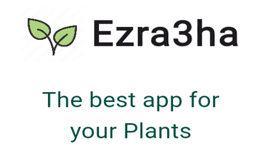

# application_project

This is a mobil application developed using Flutter framework. The purpose of the project is to create an application that can be used by end users to get the plants that can be grown in each regoin at Sultanet of Oman. Also, it gives a full instruction by images, videos, and text to care of plants from different types. Moreover, there is option for buying plant seeds and deliver it to distenation. 

## Getting Started

This project is a starting point for a Flutter application.

A few resources to get you started if this is your first Flutter project:

- [Lab: Write your first Flutter app](https://docs.flutter.dev/get-started/codelab)
- [Cookbook: Useful Flutter samples](https://docs.flutter.dev/cookbook)

For help getting started with Flutter development, view the
[online documentation](https://docs.flutter.dev/), which offers tutorials,
samples, guidance on mobile development, and a full API reference.
